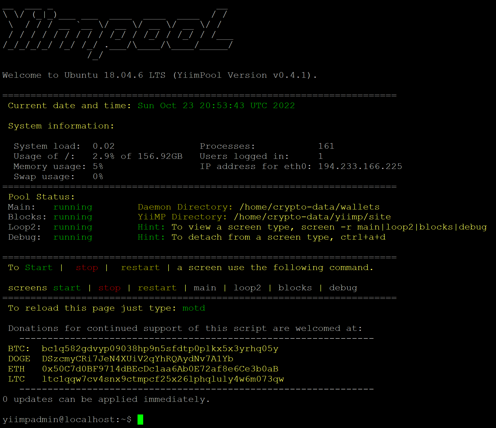

<h1 align="center"> Yiimpool Yiimp Install Scrypt v0.6.8 With DaemonBuilder And Addport Support (update 2023-01-04) </h1>


<p align="center">
  
</p>

<h2 align="center"> Description </h2>
This is the main page for Yiimpool Yiimp Install script. Here you find information all documentation about <b> Yiimpool Yiimp Installer.</b><p>The installer automatically install all requirements to get Yiimp installed correctly.</p><p><b> Yiimpool Yiimp Install script</b> is a Script that will install <b> Yiimp</b> Mining Pool on a clean <b>Ubuntu 18.04 VPS.</p>

More information will be added soon.

<h2 align="left"> ⚙️ The installer requires the following </h2>

* Fresh Ubuntu Ubuntu 18.04
* > Ubuntu 16.04 is supported but not recommended.
* Minimum RAM 4GB.
* > Recommended RAM 8GB or higher.

<h2 align="left">ℹ️ Daemonbuilder </h2>
The script will install daemonbuilder. Daemonbuilder is a tool that will Download and compile the coin for you.

To use DaemonBuilder just Type:

```
daemonbuilder
```

in the terminal and Daemonbuilder will start.
* > The compile time depends on the CPU power of your VPS.

<h2 align="center"> 💾 How to start the installation. </h2></b>

<h3 align="left"> The Installer will ask you the following questions. </h3><p>

Question | Default | Help
:--|:-:|:--
Are you using a domain name | no | If you plan to use something like example.com, make sure DNS is updated
Are you using a sub-domain as the main domain | no | If you plan to use something like pool.example.com
Domain Name | localhost | Change to your domain either example.com or pool.example.com
Stratum Domain | stratum.domain.name | This should be something other then your domain name
Install SSL | yes | Installs a 90 day cert from LetsEncrypt
Support Email | root@localhost | Used to send you system alerts
Your Public IP | pulls ip last used to acess web server | To verify go to http://www.whatsmyip.org
DB Root Password | autogenerated 36 character password | Default mysql root password
DB Panel User Password | autogenerated 36 character password | Default mysql frontend password
DB Stratum Password | autogenerated 36 character password | Default mysql stratum password
Admin Portal Access Location | AdminPortal | to access example.com/site/AdminPortal</p>


You <b>MUST RUN</b> the <b>yiimpool</b> installer under <b>root</b> or an existing <b>account</b>. If you have an existing <b>account</b> then make sure that the account have <b>sudo permissions.</b>

<h4 align="left"> 📝 Run the following commands in the terminal. </h4>

```
curl https://raw.githubusercontent.com/afiniel/yiimp_install_script/master/install.sh | bash

```


* > Installation will take approximately 25 minutes. The installer will let you know when the installation is complete.

 If you have any issues with the installation open issue here on github.

***********************************
### Finish! Remember to

```
sudo reboot
```

### A server reboot is REQUIRED after the installation is fully completed to finalize the installation process

After rebooting the server log back in to your user account you have created, when the rebooting process is complete log in again with your user account again and you have successfully install yiimp on your sever.


#### On first reboot it may take up to 1-2 minutes before the cron screens auto-start. After waiting 1-2 minutes type:
```
motd
```

#### To help make your server more secure we have changed the install locations and directory structure of YiiMP as follows:

Directory | Files
:--|:-:
/home/crypto-data/yiimp | General install location for YiiMP
/home/crypto-data/yiimp/starts | screens and stratum sh files - you do not need to run these
/home/crypto-data/yiimp/site | -
/home/crypto-data/yiimp/site/web | New location for YiiMP web files
/home/crypto-data/yiimp/site/backup | backup location for mysql DB
/home/crypto-data/yiimp/site/configuration | New location of your serverconfig.php
/home/crypto-data/yiimp/site/crons | New location of the `main:blocks:loop2` sh files
/home/crypto-data/yiimp/site/log | New location for debug.log and your nginx server log
/home/crypto-data/yiimp/site/stratum | New location for your stratum files
/home/crypto-data/wallets | New location for wallets

Permissions have been setup correctly allowing your main user write acess to the /home/crypto-data directories! Changing file or directory permissions after install will cause your YiiMP to not function correctly you have been warned!!

### If you have have not installed with dedicated port.

By default even though all stratum algos start on server start, the ports have been blocked by the firewall. To open a port type:
```
sudo ufw allow port number
```
If you have installed with dedicated port you just run the following in your terminal to add coin daemon ports.
```
addport
```
From there your YiiMP installation is fully completed. You can now go to example.com/site/AdminPortal to access your admin section and start adding your coins.

#### 🔗 Commands

To view your running screens run following
'''
screen -list
'''
To view the screen you run the following
```
screen -r main|loop2|blocks|debug
```
To detach from a screen type:
```
ctrl+a+d "DONT do: ctrl+c it will kill your screen." 
```
To start, stop or restart main|loop2|blocks|debug type:
```
screens start|stop|restart main|loop2|blocks|debug
```
We also suggest that you type:
```
yiimp
```
If you have dedicated port installed.
```
addport
```
and get to know those commands as well!


## 🎁 Support

If you find this script useful please consider donating to the following addresses:

* BTC:  bc1q582gdvyp09038hp9n5sfdtp0plkx5x3yrhq05y
* BCH: qzz0aff2k0xnwyzg7k9fcxlndtaj4wa65uxteqe84m
* DOGE: DSzcmyCRi7JeN4XUiV2qYhRQAydNv7A1Yb
* LTC:  ltc1qqw7cv4snx9ctmpcf25x26lphqluly4w6m073qw
* ETH: 0x50C7d0BF9714dBEcDc1aa6Ab0E72af8e6Ce3b0aB
